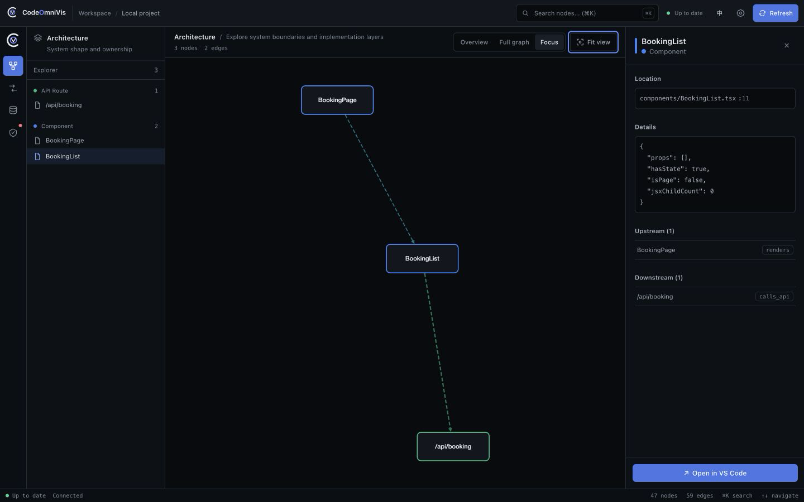
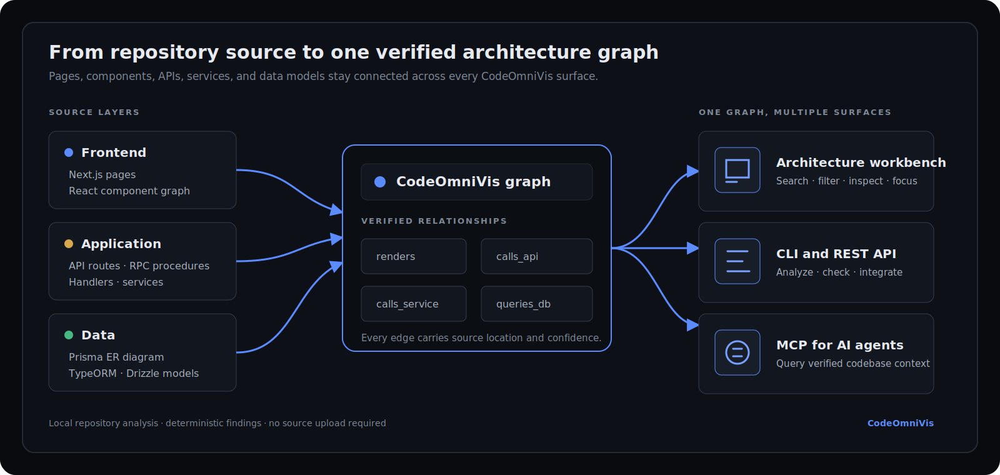
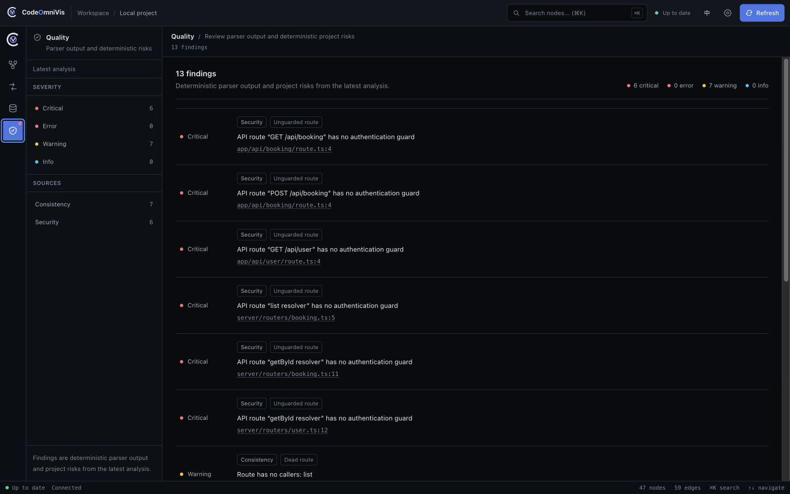
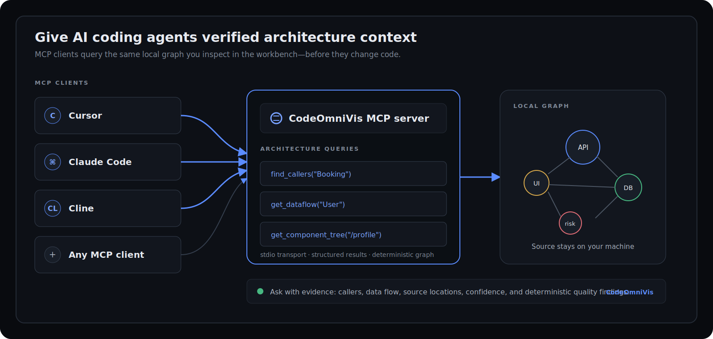

<div align="center">

<picture>
  <source media="(prefers-color-scheme: dark)" srcset="packages/ui/public/brand/logo-mark-dark.svg">
  <source media="(prefers-color-scheme: light)" srcset="packages/ui/public/brand/logo-mark-light.svg">
  
</picture>

# CodeOmniVis

### See your full-stack architecture. Give AI the context it's missing.

**A zero-config TypeScript architecture visualizer that connects Next.js pages, React components, APIs, services, and database models in one local workbench—and exposes the same graph to AI coding agents through MCP.**

[](https://github.com/Bynlk/CodeOmniVis/actions/workflows/ci.yml)
[](https://www.npmjs.com/package/@bynlk/codeomnivis)
[](https://www.npmjs.com/package/@bynlk/codeomnivis)
[](https://nodejs.org/)
[](https://www.typescriptlang.org/)
[](LICENSE)
[](https://github.com/Bynlk/CodeOmniVis)



**English** · [简体中文](README.zh-CN.md) · [Documentation](docs/README.md) · [Demo guide](demo/README.md)

</div>

<a id="quick-start"></a>

## Quick Start

```bash
npx @bynlk/codeomnivis serve
```

Run it at your repository root. CodeOmniVis detects the project, analyzes it locally, opens the workbench, and keeps the graph fresh as files change.

### What you get in the first minute

| Outcome           | What appears in the workbench                                                                              |
| ----------------- | ---------------------------------------------------------------------------------------------------------- |
| Project map       | Typed pages, components, API routes, services, database models, tests, and their relationships             |
| Cross-layer trace | Source paths, line numbers, callers, dependencies, and page-to-database paths where static evidence exists |
| Quality signals   | Parser warnings and deterministic consistency, security, N+1, and RSC-boundary findings                    |
| Live context      | One versioned local snapshot shared by the workbench, CLI/REST, and MCP, with file-change refresh          |

<a id="why-codeomnivis"></a>

## Why CodeOmniVis

Cursor, Claude Code, and Cline are already good at editing files and running commands. What they often lack is durable system context: which page reaches which API, which service queries which model, and what a change can affect across layers.

CodeOmniVis turns a repository into a **full-stack architecture graph** that humans and tools can inspect from the same source of truth. It is not another coding agent and it does not upload your source code. It is the architecture context layer underneath your existing development workflow.

Use CodeOmniVis when repository-wide search is no longer enough:

- prove how a page, component, route, service, and model are connected;
- distinguish direct relationships from inferred ones with confidence metadata;
- locate deterministic consistency and security findings at their source;
- give an AI agent evidence before it proposes a cross-layer change.

<a id="workflows"></a>

## Three workflows, one graph

### 1. Understand an unfamiliar repository

Open a large TypeScript project and start from its system shape. Move from the module overview to the full graph, then focus on one node without losing its upstream and downstream context.

### 2. Trace code across layers

Follow a Next.js dependency graph from a page into its React component graph, through an API route or tRPC procedure, into a service and a Prisma model. Source paths and line numbers remain available in the inspector.

### 3. Give AI coding agents architecture context

Run CodeOmniVis as an **MCP server for codebase architecture**. AI clients can query callers, component trees, API routes, database models, and end-to-end data flow instead of guessing from a small prompt window.

<a id="how-it-works"></a>

## How the architecture graph works



CodeOmniVis parses source code into typed nodes and relationships, resolves cross-file and cross-layer links, and transactionally stores one versioned `ProjectSnapshot` in a local `sql.js` database. The same IDs and digest are projected through three public surfaces:

- CLI commands for analysis, consistency checks, and bounded test operations;
- the React + Cytoscape.js workbench backed by REST API and WebSocket updates;
- an MCP server for AI coding agent context.

Every parser degrades to warnings instead of crashing the whole analysis. Every stored edge has existing endpoints and carries `certain` or `inferred` confidence.

<a id="product-evidence"></a>

## Product evidence

### Architecture workbench

The stable dark workbench keeps navigation, explorer, canvas, inspector, freshness, and graph scale visible at the same time. Architecture, Requests, Data model, Tests, and Quality are peer views over the same committed project snapshot.

The hero image above is a real Demo capture: `BookingPage → BookingList → /api/booking`, with the selected component's source location and callers visible in the inspector.

### Deterministic quality findings



Quality is not an AI summary. It combines parser diagnostics with deterministic project checks such as unguarded routes, dead routes, dead components, RSC boundary risks, and N+1 query patterns. English and Chinese descriptions are derived from structured issue data; literal parser errors remain unchanged.

This is **API and database dependency visualization** plus actionable source evidence—not a decorative dashboard.

### MCP architecture queries



The MCP server reads the same local graph as the workbench. A client can ask:

| Tool                 | Question it answers                                                                                         |
| -------------------- | ----------------------------------------------------------------------------------------------------------- |
| `get_api_routes`     | Which API, tRPC, TSRPC, or Express entry points exist, and what do they reach?                              |
| `get_component_tree` | What does this page or component render?                                                                    |
| `find_callers`       | Who calls this node, and which pages can be affected?                                                       |
| `list_db_models`     | Which Prisma, TypeORM, or Drizzle models were detected?                                                     |
| `get_dataflow`       | How does a model flow through API and service layers into the UI?                                           |
| `get_test_coverage`  | Which suites, cases, and fixtures were discovered, and what production nodes are they statically linked to? |

<a id="supported-stack"></a>

## Supported stack

Support is stated by evidence level so parser presence is not confused with equal production depth.

| Evidence level                 | Current coverage                                                                                                                |
| ------------------------------ | ------------------------------------------------------------------------------------------------------------------------------- |
| Demo-verified core path        | Next.js App Router, Next.js Pages Router, React components, `fetch` / `axios`, Next.js Route Handlers, tRPC, services, Prisma   |
| Parser and regression coverage | Express, NestJS controllers/modules/services, TSRPC, TypeORM, Drizzle                                                           |
| Static test intelligence       | Vitest, Jest, Playwright, Cypress, JUnit 4/5, and Kotest discovery; shared Web, REST, CLI, and MCP projection                   |
| Experimental                   | Kotlin syntax, Spring, Ktor, Room, Exposed; registered in the default pipeline with targeted tests, but less real-world breadth |
| Workspace discovery            | pnpm workspaces and Turborepo source-directory discovery; not yet a complete federated multi-package model                      |

The project also generates a **Prisma ER diagram** through database-model nodes and relation edges. TypeORM and Drizzle use the same `db_model` abstraction where their parsers can resolve a model.

See [Test intelligence](docs/guides/test-intelligence.md) for exact discovery semantics, confidence rules, no-execution defaults, and JUnit XML safety limits.

<a id="cli"></a>

## CLI

### Visualize a repository

```bash
npx @bynlk/codeomnivis serve
```

Analyze a different local path or choose an explicit port:

```bash
npx @bynlk/codeomnivis serve --project /absolute/path/to/repository --port 4321
```

### Generate a graph or run checks

`analyze` and `check` operate on the current working directory:

```bash
cd /absolute/path/to/repository
npx @bynlk/codeomnivis analyze --output codeomnivis-graph.json
npx @bynlk/codeomnivis check
```

### Command reference

| Command                                                               | Purpose                                                                             |
| --------------------------------------------------------------------- | ----------------------------------------------------------------------------------- |
| `serve --project <path> [--port 4321] [--host localhost] [--no-open]` | Analyze, serve the workbench, watch files, and publish graph updates                |
| `analyze [-o codeomnivis-graph.json]`                                 | Write the current repository graph as JSON                                          |
| `check`                                                               | Print parser diagnostics and deterministic consistency findings                     |
| `mcp --project <path>`                                                | Start the stdio MCP server                                                          |
| `test-import --project <path> --junit <file-or-glob>`                 | Import bounded JUnit XML results without executing tests                            |
| `test-run --project <path> --runner <name> [--timeout <ms>]`          | Explicitly run one enumerated test runner with shell, path, time, and output bounds |
| `init`                                                                | Generate a starter `.codeomnivis.json` file                                         |

Binding to a non-loopback host requires a token for every REST/WebSocket surface except health. Bearer clients may use the token directly; browsers exchange it once for a short-lived HttpOnly, SameSite=Strict session. Local loopback usage remains the recommended default.

<a id="mcp"></a>

## MCP setup

Add CodeOmniVis to a compatible client with an absolute project path:

```json
{
  "mcpServers": {
    "codeomnivis": {
      "command": "npx",
      "args": ["-y", "@bynlk/codeomnivis", "mcp", "--project", "/absolute/path/to/repository"]
    }
  }
}
```

If no project cache exists, the MCP process performs an initial analysis and stores its database under `~/.codeomnivis/projects/{hash}.db`. See the [MCP tool contract](docs/api/mcp-tools.md) for inputs and response shapes.

<a id="api"></a>

## REST API and live updates

`serve` exposes the workbench and a local API on the same origin. Useful entry points include:

- `GET /api/health`
- `GET /api/graph`
- `GET /api/graph/nodes`
- `GET /api/graph/edges`
- `GET /api/graph/stats`
- `GET /api/graph/errors`
- `GET /api/graph/issues`
- `GET /api/graph/dataflow`
- `GET /api/tests`
- `POST /api/analyze`
- `GET /api/project` and `POST /api/project`
- `POST /api/ai/chat` and `POST /api/ai/explain`
- `ws://<host>:<port>/ws` for `graph_updated` events

See the [REST API documentation](docs/api/rest-api.md). The browser UI uses the same endpoints and invalidates its graph, quality, project, and freshness queries together after an analysis update.

AI routes use an OpenAI-compatible `/chat/completions` upstream only when the request supplies `config` or the server has `AI_BASE_URL`, `AI_API_KEY`, and `AI_MODEL`. Without configuration they return `AI_NOT_CONFIGURED` (`501`). Destination validation, response limits, timeouts, and per-identity rate/concurrency limits apply; MCP remains the recommended AI integration for architecture queries.

<a id="limitations"></a>

## Known limitations

- Cross-layer relationships are static-analysis results. Dynamic imports, runtime dependency injection, generated code, and metaprogramming can remain unresolved.
- Monorepo support currently discovers relevant workspace source directories; it is not a complete federated package graph.
- Kotlin, Spring, Ktor, Room, and Exposed support is experimental and has less real-project coverage than the TypeScript demo path.
- Test `covers` edges are static source evidence, not runtime line coverage; dynamic names, reflection, custom DSL extensions, and runtime parameter rows can remain unresolved.
- `.codeomnivis.json` is an optional override layer, but command coverage is not yet perfectly uniform.
- AI proxy routes are optional and require explicit credentials; the Web UI remains focused on architecture exploration while MCP supplies the primary AI-agent context surface.
- Very large repositories can require more than 60 seconds. The 60-second promise is a target for supported, reasonably sized projects, not a hard timeout.

<a id="development"></a>

## Development

### Requirements

- Node.js `>= 18`
- pnpm `9`

```bash
pnpm install
pnpm build
pnpm test
pnpm typecheck
pnpm lint
```

Run the bundled demo from source:

```bash
node packages/cli/bin/codeomnivis.js serve --project ./demo --no-open
```

| Package                                  | Responsibility                                                                     |
| ---------------------------------------- | ---------------------------------------------------------------------------------- |
| [`packages/shared`](packages/shared)     | Shared graph, issue, configuration, and protocol types                             |
| [`packages/analyzer`](packages/analyzer) | Parsers, cross-layer resolution, graph building, quality checks, and local storage |
| [`packages/server`](packages/server)     | REST API, WebSocket, project switching, and incremental analysis                   |
| [`packages/ui`](packages/ui)             | React + Cytoscape.js architecture workbench                                        |
| [`packages/mcp`](packages/mcp)           | stdio MCP server and architecture query tools                                      |
| [`packages/cli`](packages/cli)           | Public command entry point and self-contained distribution                         |
| [`demo`](demo)                           | Deterministic full-stack fixture used for screenshots and integration tests        |

More detail: [project directory](docs/project-directory.md), [parser pipeline](docs/architecture/parser-pipeline.md), [graph data model](docs/architecture/data-model.md), and [visualization architecture](docs/architecture/visualization.md).

<a id="roadmap"></a>

## Roadmap

- stronger multi-package and monorepo modeling;
- aggregation and progressive expansion for very large graphs;
- broader real-project fixtures for experimental parsers;
- richer impact analysis while keeping findings deterministic;
- documented public releases and reproducible package provenance.

<a id="faq"></a>

## FAQ

### Is CodeOmniVis local-first?

Yes. Analysis, the graph database, the workbench, and MCP run on your machine without a hosted account. `serve` binds to loopback by default; exposing it on a non-loopback address requires an access token.

### Does it upload or modify my source code?

The core analyzer reads supported project files but does not modify them, upload source code, or collect telemetry. Optional `/api/ai/*` routes make no upstream request until you configure an OpenAI-compatible provider; when you use them, the messages and selected context in that request go to the provider you chose. MCP architecture queries remain local.

### How accurate is the graph?

It is static-analysis evidence, not a runtime trace. Directly resolved relationships are marked `certain`; heuristic matches are marked `inferred`; parser gaps become warnings. Dynamic imports, dependency injection, generated code, and metaprogramming can remain unresolved.

### How does MCP work?

CodeOmniVis starts as a local stdio MCP server and exposes queries over the same `ProjectSnapshot` used by the workbench. Point your client at an absolute project path; if no cache exists, the MCP process runs the initial local analysis first.

### Can I use CodeOmniVis commercially?

The repository uses the PolyForm Noncommercial License 1.0.0. Learning, research, personal, and other noncommercial use are permitted; commercial use requires separate permission from the maintainer.

<a id="contributing"></a>

## Contributing

Contributions are welcome. Start with [CONTRIBUTING.md](CONTRIBUTING.md), follow the [Code of Conduct](CODE_OF_CONDUCT.md), and report vulnerabilities through [SECURITY.md](SECURITY.md).

Please include a focused fixture and normal, malformed, and boundary tests when adding or changing a parser.

<a id="license"></a>

## License

[PolyForm Noncommercial License 1.0.0](LICENSE). The repository is available for learning, research, personal, and other noncommercial use. Commercial use requires separate permission.
