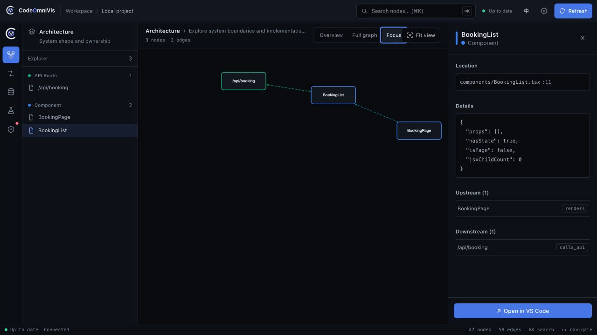

<div align="center">

<picture>
  <source media="(prefers-color-scheme: dark)" srcset="packages/ui/public/brand/logo-mark-dark.svg">
  <source media="(prefers-color-scheme: light)" srcset="packages/ui/public/brand/logo-mark-light.svg">
  
</picture>

# CodeOmniVis

### See the path from page to database before you change it.

**A local-first TypeScript architecture visualizer that maps Next.js pages, React components, APIs, services, database models, tests, and their relationships in one workbench.**

**English** · [简体中文](README.zh-CN.md) · [Documentation](docs/README.md) · [Demo guide](demo/README.md)

[](https://github.com/Bynlk/CodeOmniVis/actions/workflows/ci.yml)
[](https://www.npmjs.com/package/@bynlk/codeomnivis)
[](https://nodejs.org/)
[](LICENSE)

</div>

<a id="quick-start"></a>

## Quick Start

Run this at the root of a supported repository:

```bash
npx @bynlk/codeomnivis serve
```

CodeOmniVis analyzes the project locally, opens the workbench, and refreshes the graph when source files change. No hosted account or configuration file is required for the default workflow.



_Real bundled demo: `BookingPage → BookingList → /api/booking`, with the selected component's source location, callers, and dependencies visible._

<a id="workflows"></a>

## One graph, three workflows

| Workflow                         | What it answers                                                                                                                                          |
| -------------------------------- | -------------------------------------------------------------------------------------------------------------------------------------------------------- |
| **Map a repository**             | See the Next.js dependency graph, React component graph, API routes, services, tests, and Prisma ER diagram in one workspace.                            |
| **Trace a change**               | Follow a page across components, handlers, and services; inspect API and database dependency visualization with source paths and confidence.             |
| **Give AI architecture context** | Run the same graph as an MCP server for codebase architecture so Cursor, Claude Code, and Cline can query callers, routes, models, tests, and data flow. |

The workbench, CLI/REST surfaces, and MCP use one versioned full-stack architecture graph, so human exploration and AI coding agent context do not drift into separate models of the repository.

<a id="how-it-works"></a>

## How it works


CodeOmniVis parses supported files into typed nodes, resolves cross-file and cross-layer relationships, and stores one `ProjectSnapshot` in a local `sql.js` database. Directly resolved edges are marked `certain`; pattern-based evidence is marked `inferred`. Parser failures become warnings instead of stopping the whole analysis.

<a id="supported-stack"></a>

## Supported stack

Support is grouped by evidence level so parser presence is not mistaken for equal production depth.

| Evidence level                     | Current coverage                                                                                  |
| ---------------------------------- | ------------------------------------------------------------------------------------------------- |
| **Demo-verified core path**        | Next.js App/Pages Router, React, `fetch`/`axios`, Route Handlers, tRPC, services, Prisma          |
| **Parser and regression coverage** | Express, NestJS controllers/modules/services, TSRPC, TypeORM, Drizzle                             |
| **Static test intelligence**       | Vitest, Jest, Playwright, Cypress, JUnit 4/5, Kotest; shared Web, REST, CLI, and MCP projection   |
| **Experimental**                   | Kotlin syntax, Spring, Ktor, Room, and Exposed, with targeted tests but less real-project breadth |

Workspace discovery supports pnpm workspaces and Turborepo source directories, but it is not yet a complete federated multi-package model. See [test intelligence semantics](docs/guides/test-intelligence.md) for discovery, confidence, and no-execution defaults.

<a id="mcp"></a>

## MCP setup

Point a compatible client at the repository you want to inspect:

```json
{
  "mcpServers": {
    "codeomnivis": {
      "command": "npx",
      "args": ["-y", "@bynlk/codeomnivis", "mcp", "--project", "/absolute/path/to/repository"]
    }
  }
}
```

The MCP process reads the same local graph as the workbench and performs an initial analysis when no cache exists. See the [MCP tool contract](docs/api/mcp-tools.md) for exact inputs and response shapes.

<a id="trust"></a>

## Trust and limitations

- **Local-first:** analysis, the graph database, workbench, CLI, REST, and MCP run on your machine.
- **Source handling:** the analyzer reads supported project files but does not modify or upload source code and does not collect telemetry.
- **Optional AI egress:** `/api/ai/*` sends messages and selected context only when you configure an OpenAI-compatible provider. MCP architecture queries remain local.
- **Static evidence:** dynamic imports, runtime dependency injection, generated code, reflection, and metaprogramming can remain unresolved.
- **Scale:** the 60-second target applies to supported, reasonably sized projects, not every repository.
- **License:** learning, research, personal, and other noncommercial use are permitted. Commercial use requires separate permission from the maintainer.

Full endpoint behavior is documented in the [REST API reference](docs/api/rest-api.md).

<a id="development"></a>

## Development

Requires Node.js `>=18` and pnpm `9`:

```bash
pnpm install
pnpm build
pnpm test
pnpm typecheck
pnpm lint
```

Run the bundled fixture with `node packages/cli/bin/codeomnivis.js serve --project ./demo --no-open`. Architecture details live in the [parser pipeline](docs/architecture/parser-pipeline.md), [graph data model](docs/architecture/data-model.md), and [visualization design](docs/architecture/visualization.md).

<a id="contributing"></a>

## Contributing

Start with [CONTRIBUTING.md](CONTRIBUTING.md), follow the [Code of Conduct](CODE_OF_CONDUCT.md), and report vulnerabilities through [SECURITY.md](SECURITY.md). Parser changes should include focused normal, malformed, and boundary fixtures.

<a id="license"></a>

## License

[PolyForm Noncommercial License 1.0.0](LICENSE). Commercial use requires separate permission from the maintainer.
